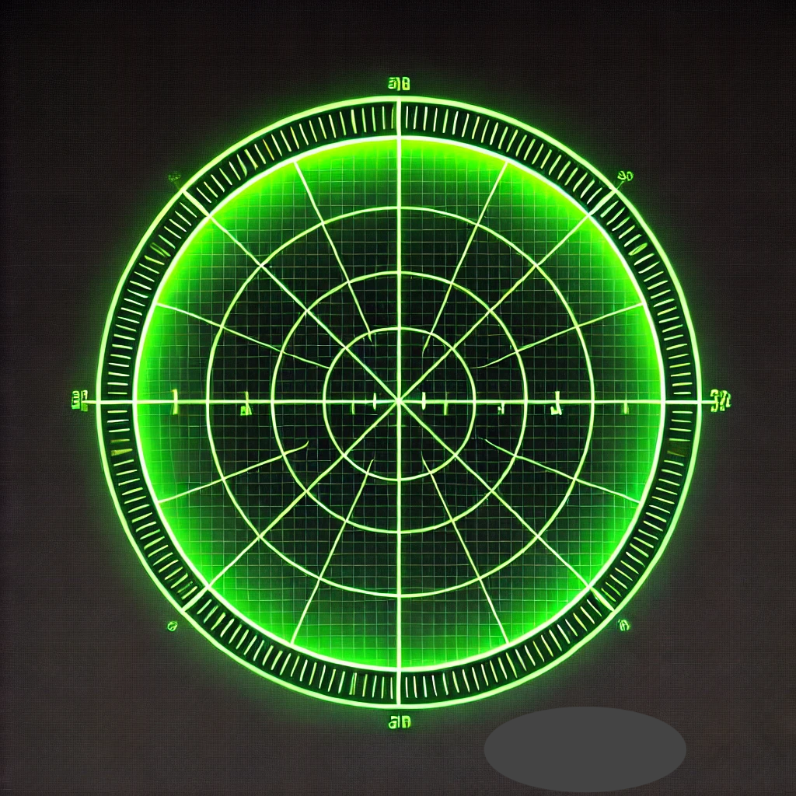

# mirrormirror
_[In Collaboration With ChatGPT4o](https://chatgpt.com/share/f1de3333-6d48-4c29-ac67-e0ca509536c4)_

> These are three tools for times you wish to immediately automatically lock your MAC laptop if:
- Your face is not detected w/in a set period of time. 
- A specified bluetooth device loses contact with your laptop. 
- Your laptop moves more than a set distance in some period of time. 


> Note!
- These default to running the lockscreen condition test every 5s. 
- Once enabled, these are designed to require the lockscreen condition to be triggered, and a re-authentication to then disable and quit the tool(s). 
- If you find this annoying, you probably do not need this tool. 
- Yahtzee!
  

## Pre-Requisites
- Intended For MAC Laptops ( tested on an Apple silicon M2 air MacOS 14.1.1 (23B81)). 
- Brew installed python 3.12 & cmake 3.30.3.arm64 &  dlib-19.24.6 .
- Conda (all commands can be run with pip as well on the user level if desired and libraries installed with pip).
- When you first run the scripts, you will be asked by MacOS to monitor inputs (prob from the terminal app you are using), you also will need to allow the same in Privay&Security->Accessibility and allow this app.

## Face Off
Locks a mac laptop if your face is not detected w/in a set period of time.  You might need to 
 
### Behavior
-  The script does not begin running when the UI boots up and does not begin running when the user ssh's into the machine. It does begin running when the user runs the script or configures to auto-load. When running, there is a small smiley face icon in the menu bar indicating the tool is running or suspended, and will dissappear when the tool quits. The conda environment MIRRORMIRROR is properly used in automating the script and ongoing running of the script.
   -  You will need to have encoded your face first.
-  When triggered because the expected face of the allowed user is not detected, the script locks the screen, requiring re-authentication to unlock (but not with face). When logged back in, the script will be in a toggled off state and only begins if toggled on.  Once turned on and scanning, the only way to disable the feature is to sudo kill the running process, or to allow the lockscreen to be triggered, re-authenticate, and with the tool in a toggled off state, you may quit it.  **It is a design feature that this tool may not be disabled w/out going through a password re-authentication**.
- If you wish to make this more fussy, please do so! But, I believe for the use case, simple and reactive is best for me.


### Environment

#### Brew Stuff
One dependency is only available via brew.  So, first you'll need brew installed.  Then:

```bash
brew install blueutil ffmpeg cmake
```

#### Conda Stuff (and by conda, I mean miniconda)
I use conda b/c it's quick and easy for me. You can also use venvs, pip install this all into your user python, or whatnot.

```bash
conda create -y -n MIRRORMIRROR -c conda-forge python==3.12.2 opencv ipython pytest face_recognition && \
conda activate MIRRORMIRROR && \
pip install pystray pynput
echo "happy birthday!"
```

<hr>
<hr> 
<hr>

### The Three Tools
#### First, Activate MIRRORMIRROR

```bash
conda activate MIRRORMIRROR
```

<hr>
<hr>

#### FaceOff


- When running these, you might need to tell your cell phone to disconnect if it tries to be the webcam.  Manually edit `cv2.VideoCapture(0) ` to be 0 or 1 if needed & automate this part if inspired to do so.
 
##### Face Encoding
Run [`bin/face_encoding.py`](bin/face_encoding.py) to create an encoding of your face.


##### Face Off Monitoring Tool
EDIT [`bin/face_off.py`](bin/face_off.py) to set whatever timout thresholds and point to your face encoding file.  For extra points, rename the file. Then run it.

> Run the script and allow it to fail so that you can grant permission for it to lock the screen on your behalf.


### Automate Enabling Toggle Hotkey And Menu Bar Icon

#### Create LaunchAgent XML
_launchagent steps not yet tested_
Create `~/Library/LaunchAgents/com.$USER.faceoff.plist`, rename to match the above script. Use this template:

```xml
<?xml version="1.0" encoding="UTF-8"?>
<!DOCTYPE plist PUBLIC "-//Apple//DTD PLIST 1.0//EN" "http://www.apple.com/DTDs/PropertyList-1.0.dtd">
<plist version="1.0">
<dict>
    <key>Label</key>
    <string>com.username.faceoff</string>
    <key>ProgramArguments</key>
    <array>
        <string>/path/to/conda/envs/MIRRORMIRROR/bin/python</string>
        <string>/path/to/face_off.py</string>
    </array>
    <key>RunAtLoad</key>
    <true/>
    <key>KeepAlive</key>
    <false/>
    <key>EnvironmentVariables</key>
    <dict>
        <key>PATH</key>
        <string>/usr/local/bin:/usr/bin:/bin:/usr/sbin:/sbin</string>
    </dict>
</dict>
</plist>
```


#### Load The LaunchAgent
```bash
launchctl load ~/Library/LaunchAgents/com.username.faceoff.plist # rename to match scipt name above
```

<hr>


## You Can Leave


A tool to lock your MAC laptop if your bluetooth device looses contact with your laptop.

### Behavior
-  The tool does not begin at boot up or when the user logins in to the UI or by ssh.
-  The tool may be start the tool by running the script, or automating its launch at runtime. The tool, once running, needs to be specifically enabled to work. There is a small icon in the menu bar indicating the tool is running, and if running, if it is enabled or not. When the tool is started, the menu displays the detected bluetooth devices. You must select a device to monitor before you may enable monitoring for lock condition. When the device is not detected, the lockscreen is brough up and requires re-auth to unlock(assuming this is how your lockscreen is configured). When you re-auth, the tool will still be running, but now disabled. You may now quit it, or select a new device to monitor + enable monitoring.


### Environment
#### Activate MIRRORMIRROR

```bash
conda activate MIRRORMIRROR
```


### Tool Script
Edit [`bin/you_can_leave.py`](bin/you_can_leave.py) to set whatever timout thresholds and point to your face encoding file.  For extra points, rename the file. Then run it.

### Helpful Stuff

```bash
blueutil --paired
```

### Automate Enabling Toggle Hotkey And Menu Bar Icon
#### Create LaunchAgent XML
_launchagent steps not yet tested_
Create` ~/Library/LaunchAgents/com.$USER.youcanleave.plist` (rename to match the above script), use this template::

```xml
<?xml version="1.0" encoding="UTF-8"?>
<!DOCTYPE plist PUBLIC "-//Apple//DTD PLIST 1.0//EN" "http://www.apple.com/DTDs/PropertyList-1.0.dtd">
<plist version="1.0">
<dict>
    <key>Label</key>
    <string>com.username.youcanleave</string>
    <key>ProgramArguments</key>
    <array>
        <string>/path/to/conda/envs/MIRRORMIRROR/bin/python</string>
        <string>/path/to/bluetooth_lock.py</string>
    </array>
    <key>RunAtLoad</key>
    <true/>
    <key>KeepAlive</key>
    <false/>
    <key>EnvironmentVariables</key>
    <dict>
        <key>PATH</key>
        <string>/usr/local/bin:/usr/bin:/bin:/usr/sbin:/sbin</string>
    </dict>
</dict>
</plist>
```


#### Load The LaunchAgent
```bash
launchctl load ~/Library/LaunchAgents/com.username.youcanleave.plist # rename to match scipt name above
```

<hr>

## But Dont Go Far
A script to lock your MAC laptop if it moves more than a set distance in some period of time.


### Behavior
- The tool does not begin at boot up or when the user logins in to the UI or by ssh.
- The tool may be started/stopped by the user with the hotkey `Command + Shift + G`. There is a small `DGF` icon in the menu bar indicating the tool is running or not, and may also be clicked to turn on/off. When the tool is started, it reports the current address detected, and asks the user to specify how many miles as a float will trigger the tool to lock and close all windows, requiring a user to re-auth to log back in.  When toggling off, the specified address and distance tolock us cleared and will be reprompted when the user toggles this tool back on. When triggered, there is a warning, and a 15 sec delay before the screen is locked and all open apps closed (this delay can not be preempted). The only actions allowed when this warning appears are save actions in all open apps
- When triggered because the specified device has lost connection, the screen is locked, and all open apps closed, requiring the user to re-authenticate to log back in. When logging back in, the tool is not started automatically.
- When triggered because the specified device hss lost connection, the user MAY NOT turbn off the tool. Nor may the user click the menu icon to turb off.
- The tool does not interfere with the normal operation of the computer, and does not cause any noticeable performance issues.


### Environment
We will use the conda MIRROR environment created above.


### Tool Script
Edit [`bin/but_dont_go_far.py`](bin/but_dont_go_far.py) to set whatever timout thresholds and point to your face encoding file.  For extra points, rename the file. Then run it.

### Automate Enabling Toggle Hotkey And Menu Bar Icon
#### Create LaunchAgent XML
_launchagent steps not yet tested_
Create `~/Library/LaunchAgents/com.$USER.butdontgofar.plist` (rename to match the above script), use this template:

```xml
<?xml version="1.0" encoding="UTF-8"?>
<!DOCTYPE plist PUBLIC "-//Apple//DTD PLIST 1.0//EN" "http://www.apple.com/DTDs/PropertyList-1.0.dtd">
<plist version="1.0">
<dict>
    <key>Label</key>
    <string>com.username.butdontgofar</string>
    <key>ProgramArguments</key>
    <array>
        <string>/path/to/conda/envs/MIRRORMIRROR/bin/python</string>
        <string>/path/to/distance_lock.py</string>
    </array>
    <key>RunAtLoad</key>
    <true/>
    <key>KeepAlive</key>
    <false/>
    <key>EnvironmentVariables</key>
    <dict>
        <key>PATH</key>
        <string>/usr/local/bin:/usr/bin:/bin:/usr/sbin:/sbin</string>
    </dict>
</dict>
</plist>
```

#### Load The LaunchAgent
```bash
launchctl load ~/Library/LaunchAgents/com.username.butdontgofar.plist # renme to match scipt name above
```


## Issues Observed
- The face recognition library had a problem with the conda dlib, which necessitated brew python update and cmake update, then repip installing dlib  dlib-19.24.6.